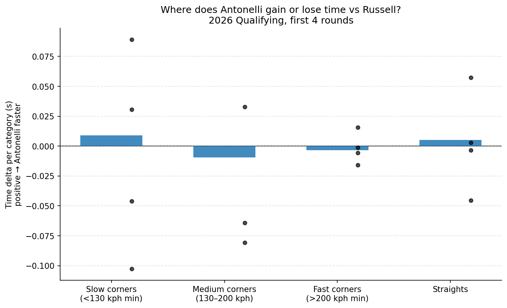
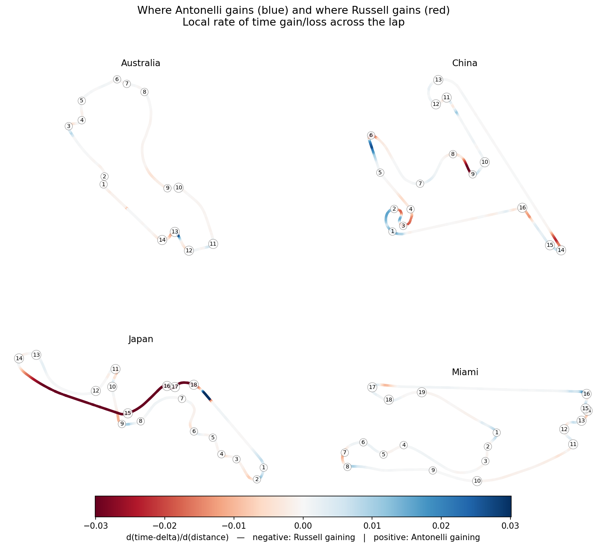

# Antonelli vs Russell: A Segment-Level Look at the 2026 Mercedes Rookie

**Antonelli has overtaken Russell on qualifying pace. How is he winning?**

I built this to dig into Kimi Antonelli's 2026 season racing for Mercedes by comparing his qualifying laps to George Russell's, broken down by track segment. They're driving the same car, with the same team of engineers — so the differences are mostly about the drivers (with caveats covered in [Limitations](#limitations)).

---

## Headline findings

After the first 4 rounds of 2026:

- **Antonelli has overtaken Russell.** He was 0.29 s slower at Australia (R1) but has been faster every round since, with the margin growing each race: R2 +0.22 s → R3 +0.30 s → R4 +0.40 s. The four-race mean is +0.16 s in his favour, with a clear monotone trend. Sector-time data confirms each lap-level delta.
- **Trajectory is the strongest signal.** The category-level breakdown is much quieter — once the sensor-quality filter removes five compromised Japan segments, all four categories (slow / medium / fast corners and straights) collapse to within ±0.01 s/lap of each other. Antonelli's lap-time advantage is spread across the lap, not concentrated in any single phase.
- **Earlier per-category claims were Japan-freeze artifacts.** A first pass reported +0.17 s/lap on straights and −0.46 s/lap in medium corners — both numbers were almost entirely driven by five Japan segments where Antonelli's speed sensor was frozen near 189 kph for over 1.3 km of the lap. See [Limitations](#limitations) for the detection and the fix.
- **Honest summary:** n=4 races and one of them partially compromised. The trajectory is what I'd defend; the category breakdown is something I'd want more clean races to claim with confidence.



For a finer-grained view, the figure below maps the local time-delta slope onto each circuit. **Blue** = Antonelli is gaining on Russell at that part of the track; **red** = Russell is gaining on Antonelli. Corner numbers are overlaid for orientation.



---

## Why teammate comparison

Driver-vs-field comparisons in F1 are dominated by car performance. A Mercedes driver beating the midfield median tells you more about car performance than driver skill.

Comparing teammates controls for that. Same chassis, same power unit, same engineering team, same tire allocation. What's left is mostly driver — with caveats covered in [Limitations](#limitations).

---

## Method

**Data:** FastF1 telemetry for the 2026 qualifying sessions of the Australian, Chinese, Japanese and Miami Grands Prix. Each driver's fastest valid lap is used.

**Segmentation:** Track segments are auto-generated from FastF1's `circuit_info.corners`, grouping nearby corners into single segments (default threshold: 250m). This produces 12-20 segments per circuit.

**Time delta:** Both drivers' telemetry — including FastF1's per-sample `Time` channel — is resampled onto a uniform 5m distance grid. Segment time is read directly from that resampled `Time` channel as `Time[last_step] − Time[first_step]` within the segment's distance bounds. Segment delta is `Russell_time − Antonelli_time` (positive = Antonelli faster).

_An earlier version of the analysis integrated `Δd / speed` per step instead. On 2 of the 4 races the accumulated residual exceeded the 0.1s sanity-check threshold below, so the method switched to reading FastF1's sample times directly. Residuals are now ≤ 0.1s on all four races — see the notebook's sanity-check section._

**Sanity check:** The sum of segment deltas across a lap is verified to match the actual lap-time delta within 0.1s. Larger discrepancies indicate a bug.

---

## Project structure

```
antonelli-vs-russell/
├── README.md
├── requirements.txt
├── notebooks/
│   └── 01_antonelli_vs_russell.ipynb     # main analysis
├── src/
│   ├── loaders.py        # FastF1 session, lap, telemetry loading
│   ├── benchmarks.py     # teammate comparison logic
│   ├── segments.py       # circuit segmentation + time-delta math
│   └── plotting.py       # styled chart helpers
├── figures/              # exported PNGs used in this README
└── tests/
    └── test_segments.py  # lap-delta consistency check
```

---

## Reproducing

```bash
git clone https://github.com/{your-handle}/antonelli-vs-russell.git
cd antonelli-vs-russell
pip install -r requirements.txt
jupyter lab notebooks/01_antonelli_vs_russell.ipynb
```

First run downloads ~411 MB of FastF1 session data into `./fastf1_cache/` (gitignored). Subsequent runs are local and fast.

After install, verify the math wires correctly:

```bash
pytest tests/
```

Tested with FastF1 3.8.1, Python 3.12.

---

## Limitations

A short list of what this analysis does _not_ control for:

- **Sample size.** 4 qualifying sessions. Findings are directional, not conclusive.
- **Q-session timing.** Q1, Q2, Q3 happen on an evolving track. If one driver's best lap is in Q3 and the other's is in Q2, track conditions differ. The notebook flags these cases.
- **Traffic.** Out-laps, in-laps, and other cars on track affect achievable lap time.
- **Tire age within Q.** Same compound, but tire-age within a Q-session run can differ by a few laps.
- **Setup divergence.** Mercedes drivers don't always run identical setups. Public data can't distinguish driver delta from setup delta.
- **Telemetry sensor freezes.** FastF1's car telemetry occasionally stops reporting changes for long stretches — Antonelli's Japan lap is the clearest case in this dataset, with the speed sensor stuck at 189 kph and `nGear` stuck in 4th from ≈ 4000 m to the end of the lap. When that happens, integrated `Distance`, `Speed`, and the X/Y trajectory all become unreliable in the affected segments. Lap-level and sector-level deltas are unaffected (those come from timing-line beams, independent of the car telemetry), and I cross-checked Japan's sector splits to confirm Antonelli's +0.30 s lap advantage is real. The notebook detects freezes with a sliding-window check (≤ 5 unique `Speed` values across any 50-sample window spanning ≥ 300 m of distance) plus an out-of-range check (segments that extend past either driver's reported telemetry distance). Five Japan segments are flagged and excluded from the category headline. **This filter materially changed the headline:** earlier passes reported large per-category deltas (+0.17 s/lap on straights, −0.46 s/lap in medium corners) that turned out to be the freeze artifacts. Once excluded, the category-level signal collapses to ≈ 0 s/lap everywhere and the trajectory becomes the only robust finding.

These caveats matter. I treated this as a careful look at what the available telemetry shows, not a definitive verdict on relative driver skill.

---

## What I'd build next

- Extend across the rest of the 2026 season as races complete.
- Add race-pace comparison (stint-level, fuel-corrected) once enough race data accumulates.
- Compare Antonelli's rookie progression to other recent Mercedes rookies (Russell 2022, Hamilton 2007) using the same segment-delta framework.

---

## About

I'm Cole Richards — UCLA Statistics & Data Science, June 2026. [Portfolio](https://milescoler.github.io)

Data via [FastF1](https://github.com/theOehrly/Fast-F1) by Philipp Schaefer. Not affiliated with Formula 1 or Mercedes.
