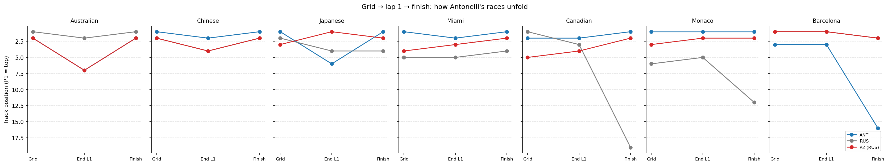
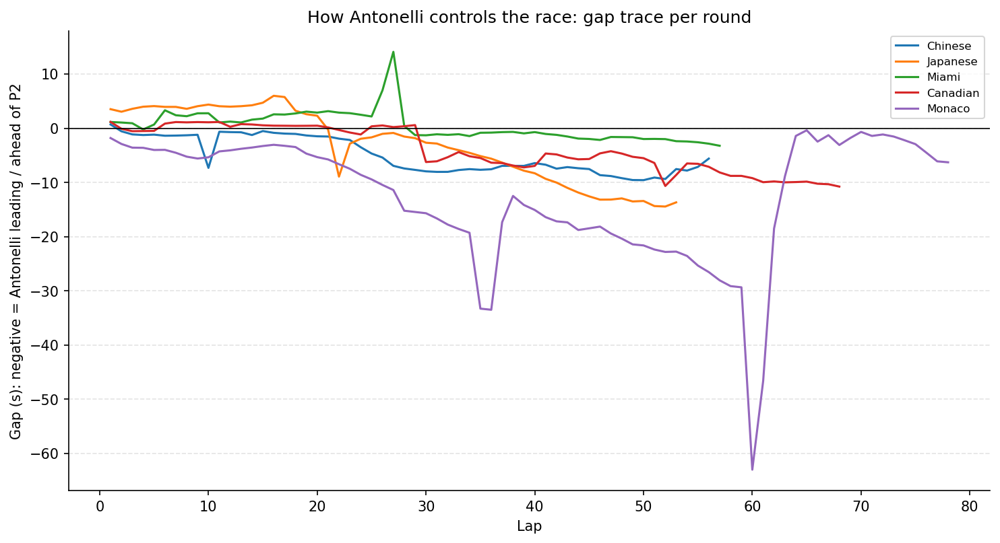
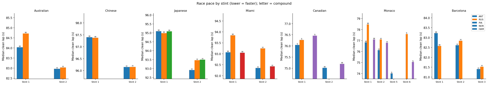
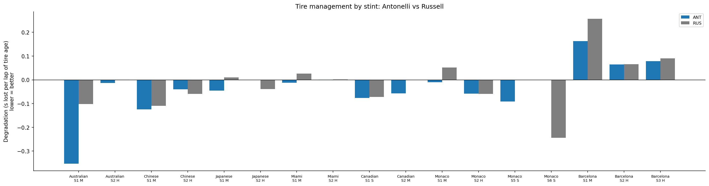
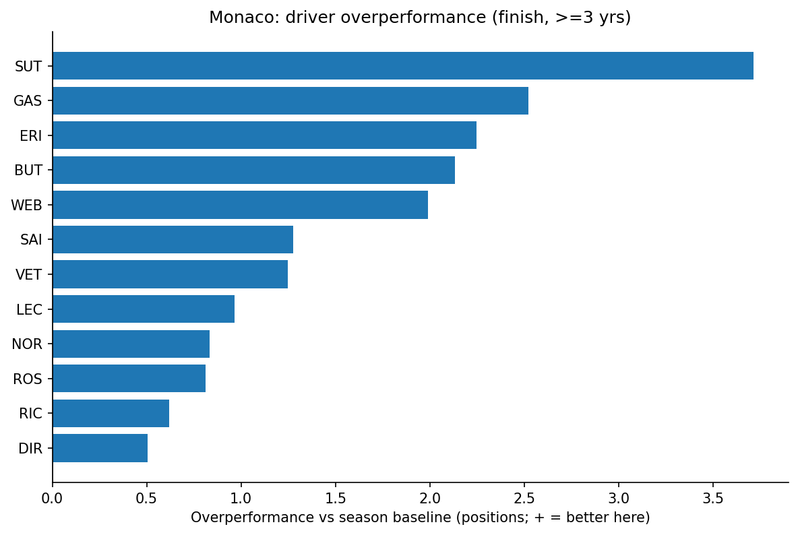
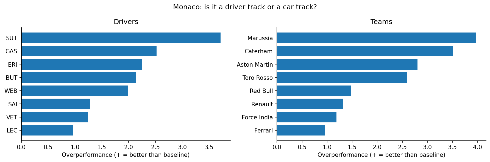
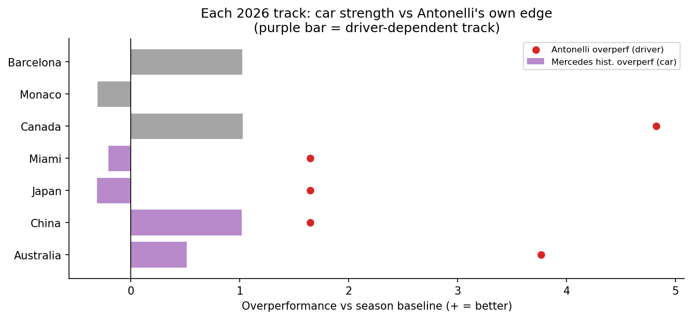

# Separating the Driver from the Car: How Good Is Kimi Antonelli, Really?

**Antonelli won 5 of his first 7 races — then Barcelona broke the run: Russell out-qualified him and he retired. How much of the winning is him, and how much is the Mercedes?**

That question is hard because driver and car are tangled together in every result. This project pulls them apart three different ways, each controlling for the car from a different angle. The throughline: **a fast car flatters a driver everywhere — so the interesting signal is whatever survives once you divide the car out.**

> **One-page summary:** [`case_study.pdf`](case_study.pdf)
> **Notebooks (no code):** [Ch1 — Qualifying](notebooks/01_antonelli_vs_russell_no_code.pdf) · [Ch2 — Race wins](notebooks/02_how_antonelli_wins_races_no_code.pdf) · [Ch3 — Track history](notebooks/03_driver_vs_car_track_history_no_code.pdf)

---

## The three chapters

| Chapter | Question | How it removes the car | Notebook |
|--------|----------|------------------------|----------|
| **1 — Qualifying** | Is he faster than his teammate? | Same car, same season (Russell) | [`01`](notebooks/01_antonelli_vs_russell.ipynb) |
| **2 — Race wins** | How does he convert pace into wins? | Same car, same race (Russell + the per-race P2 finisher) | [`02`](notebooks/02_how_antonelli_wins_races.ipynb) |
| **3 — Track history** | Are his wins at "driver tracks" or "car tracks"? | Same track, across years (overperformance vs each season's own baseline) | [`03`](notebooks/03_driver_vs_car_track_history.ipynb) |

**2026 race record through Barcelona (R7):**

| Round | Race | Grid → Finish | |
|---|---|---|---|
| 1 | Australia | P2 → **P2** | a finishing loss (lost to Russell) |
| 2 | China | P1 → **P1** | win from pole |
| 3 | Japan | P1 → **P1** | win from pole |
| 4 | Miami | P1 → **P1** | win from pole |
| 5 | Canada | P2 → **P1** | led by L2; Russell (pole) retired |
| 6 | Monaco | P1 → **P1** | pole to flag-to-flag win |
| 7 | Barcelona | P3 → **DNF** | streak-breaker: Russell took pole, then Antonelli retired |

---

## Chapter 1 — Qualifying (getting to the front)

Antonelli and Russell drive the same Mercedes, so their fastest-lap delta is mostly driver.

- **He out-qualifies Russell more often than not, but the trend is noisy, not monotone.** Round by round (positive = Antonelli faster): R1 −0.29 → R2 +0.22 → R3 +0.30 → R4 +0.40 → **R5 −0.07** → **R6 +0.39** → **R7 −0.32**, seven-race mean **+0.09 s**. The clean early climb broke at Canada, snapped back with a dominant Monaco pole, then broke again at Barcelona — where Russell took pole and out-qualified him for the first time this season.
- **The segment-level split is essentially flat** — straights +0.009, slow corners −0.005, fast corners −0.007, medium corners −0.011 s/lap (all within ±0.011). His edge isn't concentrated in one phase of the lap.
- **Where a concrete mechanism *does* show up is fast-corner commitment:** at corners ≥200 kph he brakes ~**15 m later** and gets to full throttle ~**19 m sooner** than Russell (14 data points across seven races — directional).
- **The most durable signal is year-over-year.** Against his 2025 rookie season at the same seven tracks, Antonelli has gained **+0.46 s/track** on Russell (range −0.06–0.77). Still a clear compression of the gap to his teammate — though Barcelona is the first track where he didn't improve on his rookie self.


---

## Chapter 2 — Race wins (converting it)

Qualifying explains the grid; it doesn't explain the wins. Same teammate control, plus the actual P2 finisher of each race as a field reference. Sign convention: **positive = Antonelli better**. Clean lap = green-flag racing lap (`TrackStatus == '1'`, not lap 1, not in/out/pit).

- **Start & lap 1.** Monaco is the clean case (pole → flag-to-flag); Canada is the converted-then-inherited case (P2 → led by lap 2 → won after Russell's retirement); Australia is the honest counter-case (P2 → P2 — a finishing-position loss, not a start failure); Barcelona is the bluntest counter-case yet (qualified only P3, briefly passed Russell, then retired — no finish at all).
- **Pace & control.** On the four pole-to-win races the per-lap gap trace shows Antonelli leading and *extending*. Canada is the exception — that lead was partly inherited. Stint pace is read only across matching compounds, and is **not** fuel-corrected (named, not modelled).
- **Tire degradation.** Per-stint clean-lap slope vs tire age, ANT vs Russell, like-compound only; stints under 5 clean laps report NaN rather than a noisy number.






---

## Chapter 3 — Track history (driver track or car track?)

The teammate comparison removes the car *within* a season. This removes it *across* seasons. For each driver-year we take *(their average finish over the season's **other** rounds) − (their finish at this track)*: positive means they did better here than their own season norm, with car quality largely divided out. Averaged over many years that's a driver's **track affinity**; the same arithmetic on **teams** exposes track-specific *car* strengths. `finish` excludes DNF rounds; `grid` (qualifying) is the DNF-free cross-check.

- **Monaco, the centerpiece.** Restricting to drivers/teams with ≥3 years at the circuit, the largest *persistent* overperformance belongs to teams about as much as to any single driver — so in this dataset Monaco reads as much like a **car track** as the archetypal "driver's track." A useful, slightly counter-reputational result.
- **Every 2026 track in context.** Each circuit is tagged driver- vs car-dependent and shown against Mercedes' historical standing and Antonelli's own (tiny-sample) overperformance — so each of his wins gets a "how much was the car here?" read.





> **Data note:** Chapter 3 runs on this project's data source, whose history is internally consistent but **not** real-world F1. Every claim here is *"in this dataset"* — read from the numbers, not from real-world reputation.

---

## Updating after a new race

The whole pipeline is driven by one list. To bring the project current after a Grand Prix:

1. Append the new race to `RACES` in [`src/season.py`](src/season.py) — the single edit point.
2. Run `python scripts/refresh.py` (fetches any missing session, re-executes all three notebooks, regenerates every figure and PDF).
3. Commit the regenerated artifacts.

The first Chapter-3 run is slow — it downloads ~16 seasons of results-only data into `fastf1_cache/` (gitignored). After that it's local and fast.

---

## Method

**Qualifying (Ch1):** FastF1 telemetry for 2026 qualifying. Each driver's fastest valid lap, resampled onto a uniform 5 m distance grid; segment time read from FastF1's `Time` channel; segment delta = `Russell − Antonelli` (positive = Antonelli faster). A sensor-quality filter excludes segments where a frozen `Speed` sensor corrupts the telemetry (see Limitations).

**Race (Ch2):** FastF1 Race sessions, laps only. Metrics build on a shared clean-lap filter (`TrackStatus == '1'`, not lap 1, not in/out/pit). Start conversion, per-stint median pace, per-lap gap-to-rival, and tire-degradation slope.

**Track history (Ch3):** results-only loads across `YEARS` (2010–2025). Overperformance = season baseline (over a driver's other rounds) minus their result at the track; aggregated per driver and per team, with a small-n flag (`MIN_TRACK_YEARS = 3`).

---

## Project structure

```
f1_project/
├── README.md
├── case_study.pdf
├── requirements.txt
├── notebooks/
│   ├── 01_antonelli_vs_russell.ipynb            # Ch1 — qualifying
│   ├── 02_how_antonelli_wins_races.ipynb        # Ch2 — race wins
│   ├── 03_driver_vs_car_track_history.ipynb     # Ch3 — track history
│   └── *_no_code.pdf / *.pdf                     # exported reading copies
├── src/
│   ├── season.py          # single source of truth: RACES + YEARS
│   ├── loaders.py         # FastF1 qualifying session/lap/telemetry loading
│   ├── benchmarks.py      # teammate comparison + sensor-quality filter (Ch1)
│   ├── segments.py        # circuit segmentation + time-delta math (Ch1)
│   ├── race.py            # race-session metrics: start/pace/tire/gap (Ch2)
│   ├── track_history.py   # cross-year overperformance engine (Ch3)
│   └── plotting.py        # all styled chart helpers
├── scripts/
│   └── refresh.py         # one-command season refresh
├── figures/               # exported PNGs used in this README
├── docs/                  # case study + design specs / implementation plans
└── tests/                 # invariant tests for each module
```

---

## Reproducing

```bash
git clone https://github.com/milescoler/antonelli-vs-russell.git
cd f1_project
pip install -r requirements.txt
python scripts/refresh.py     # fetch data, run all notebooks, regenerate outputs
pytest tests/                 # invariant checks (skip cleanly if cache is empty)
```

Tested with FastF1 3.8.x, Python 3.12. The first run downloads session data into `./fastf1_cache/` (gitignored); subsequent runs are local.

---

## Limitations

- **Sample size.** Seven 2026 races (one a DNF), and the race-mechanism chapter has even thinner data than qualifying. Findings are directional, not conclusive.
- **Synthetic historical data (Ch3).** Claims are "in this dataset," not real F1 history.
- **DNF handling (Ch3).** Finish-based overperformance excludes DNF/lapped rounds — this removes luck/reliability noise but discards information; the grid cross-check is the DNF-free corroboration.
- **Small samples (Ch3).** Drivers/teams below `MIN_TRACK_YEARS` are flagged; Antonelli's own 1–2 years are directional only; the driver-vs-car call is a qualitative read, not a fitted model.
- **Team rebrands** over a 16-season window are treated as-is, not stitched into lineages.
- **Q-session timing, traffic, tire age, setup divergence** (Ch1) and **no fuel/strategy correction, SC/VSC laps excluded** (Ch2) — named, not modelled away.
- **Telemetry sensor freezes.** FastF1's car telemetry occasionally stops reporting changes for long stretches — Antonelli's Japan qualifying lap is the clearest case (speed stuck at 189 kph, `nGear` stuck in 4th from ≈4000 m). A sliding-window check flags and excludes five Japan segments from the Ch1 category headline; lap- and sector-level deltas (from timing beams) are unaffected.

---

## About

I'm Cole Richards — UCLA Statistics & Data Science, June 2026. [Portfolio](https://milescoler.github.io)

Data via [FastF1](https://github.com/theOehrly/Fast-F1). Not affiliated with Formula 1 or Mercedes.
