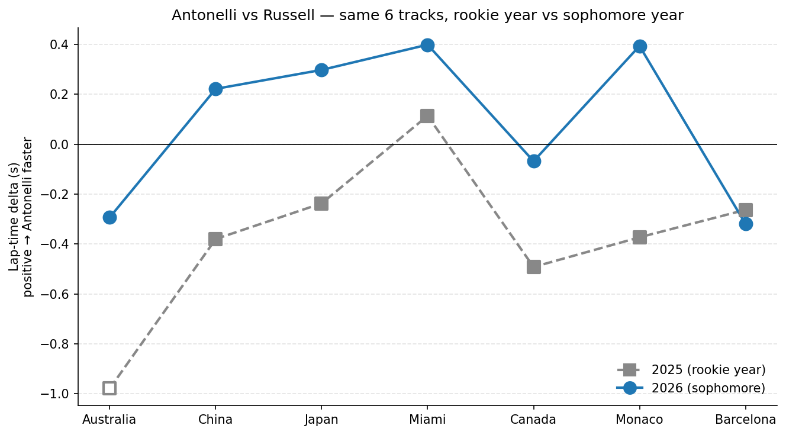

# Antonelli vs Russell

## A segment-level look at a Mercedes rookie's sophomore year

**At every one of the same 4 tracks, Antonelli has gained 0.3–0.7 s on Russell year-over-year.**

## The question

Driver-vs-field comparisons in F1 are dominated by car performance — a Mercedes driver beating the midfield median tells you about the car, not the driver. Comparing teammates controls for that: same chassis, same engineering team, same tire allocation. I wanted to know where Kimi Antonelli's rookie season ended and his sophomore year began, by comparing his qualifying laps to George Russell's track-by-track.

## What I built

A Python pipeline on top of FastF1 telemetry. For each qualifying session it pulls each driver's fastest valid lap, resamples telemetry to a uniform 5 m distance grid, and reads per-segment time directly from FastF1's `Time` channel. Track segments are auto-generated by clustering circuit-info corners; categories (slow / medium / fast corner, straight) are assigned from each segment's minimum speed. A sanity-check test asserts the sum of segment deltas matches the lap-time delta within 0.1 s on every race.

## What I found

- **Year-over-year:** Antonelli has gained between 0.3 and 0.7 s on Russell at all four tracks since his rookie year (**mean +0.53 s/track**).
- **2026 trajectory:** He was 0.29 s slower than Russell at Australia (R1) but has been faster every round since, with the margin growing each race (R2 +0.22 s → R4 +0.40 s, four-race mean +0.16 s).
- **Independent cross-check:** Sector delta data confirms each lap-level delta, including a Japan lap where the car's telemetry was partially compromised.
- **Where the time comes from:** At fast corners (≥ 200 kph), Antonelli brakes about 21 m later than Russell on average and gets back to full throttle about 23 m sooner — the late-brake / early-throttle commitment signature. At slower corners his approach is the opposite (he brakes earlier and accelerates later), but the fast-corner gain wins out on net.

## What I learned about doing this kind of work

My initial analysis reported a +0.17 s/lap straights advantage and a -0.46 s/lap medium-corner deficit for Antonelli. Both turned out to be data-quality issues — at Japan, Antonelli's speed sensor froze near 189 kph for over 1.3 km of the lap, distorting the per-segment distances and inflating the per-segment times in that region. Adding a freeze-detection filter (≤ 5 unique `Speed` values across any 50-sample window spanning ≥ 300 m of distance, plus an out-of-range check) caught five Japan segments; with them excluded, every category collapses to within ±0.01 s/lap of zero, and the year-over-year and within-2026 trajectories become the only findings the data actually supports. Watching my initial headline collapse under a stricter filter was the most useful thing this project taught me.

---

**Repo:** github.com/milescoler/antonelli-vs-russell · **Cole Richards** · UCLA Statistics & Data Science · milescoler@gmail.com · [milescoler.github.io](https://milescoler.github.io)

Built in Python with FastF1, pandas, matplotlib, and pytest.
